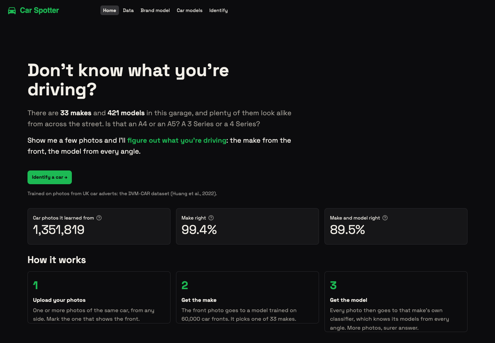
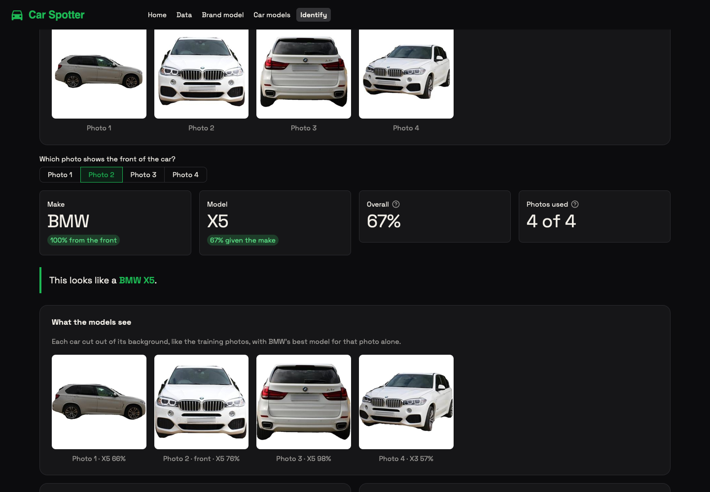
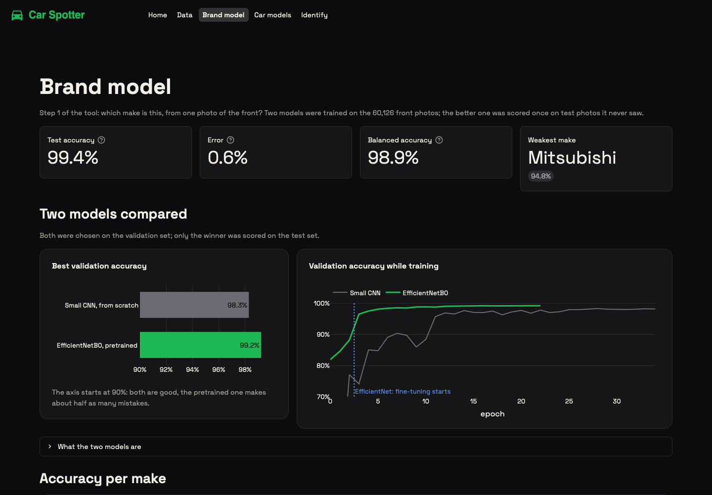
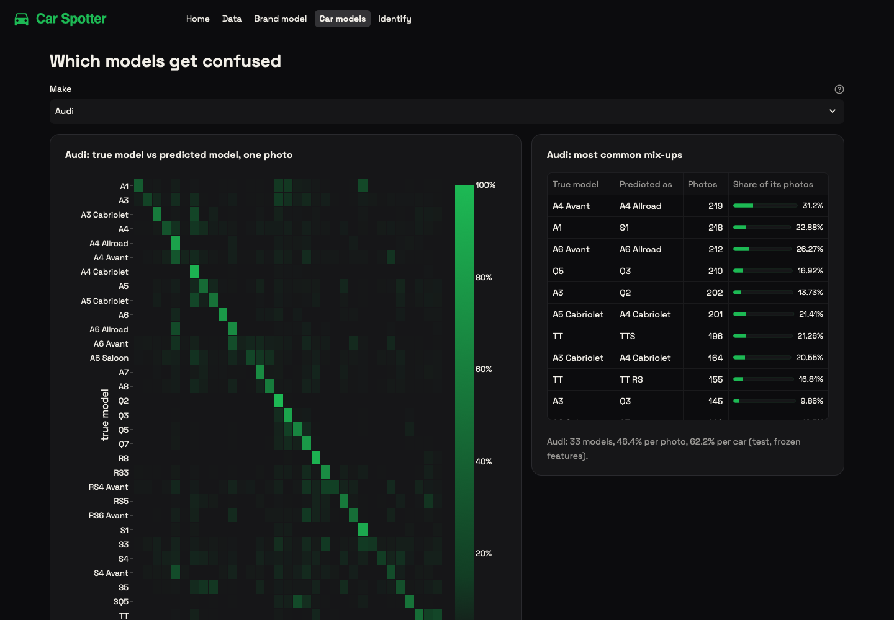

# Car Spotter

Don't know what you're driving? Upload a few photos of a car and this project tells you its make and model: the make from a photo of the front, the model from photos taken at any angle. It's trained on 1.35 million photos from UK car adverts and runs as a small Streamlit app.



## How it works

Recognising the model directly among 421 cars is hard and expensive to train. So the work is split in two steps:

1. **Make, from the front.** A pretrained EfficientNetB0, fine-tuned on 60,126 car fronts, picks one of 33 makes. On test photos it never saw, it's right **99.4%** of the time.
2. **Model, from every angle.** Each make has its own small classifier that knows only that make's models (BMW has 27, from the 1 Series to the Z4), trained on photos from all 8 angles. Only the classifiers of the likely makes run, and all the photos of the car are averaged.

Each (make, model) pair scores P(make) × P(model | make): if the front photo says 95% BMW and 5% Mercedes-Benz, only those two classifiers look at the photos.



## What's in the app

The dashboard's code lives in `dashboard.ipynb` (run it to write `dashboard/`), and the app starts with `.venv/bin/streamlit run dashboard/app.py`. Five pages:

- **Home**: what the tool is for, in one screen.
- **Data**: the two sets of photos, how they were cleaned, one car from all 8 angles, photos per make and per angle.
- **Brand model**: the two models compared, test accuracy and error, accuracy per make, which makes get confused.
- **Car models**: accuracy per make, per angle and per number of photos, fine-tuning results, and a confusion heatmap for any make.
- **Identify**: the tool. Upload one or more photos of the same car, mark the one that shows the front, get the make and model.

Photos are cut out of their background first, with YOLO11-seg: the training photos all have a white background, so a street photo is cropped to match.

## The data

[DVM-CAR](https://deepvisualmarketing.github.io/) (Huang et al., 2022): 1.45 million photos from about 250,000 UK car adverts, with the make, model, year and viewing angle of every photo. It's about 17 GB and isn't in the repo.

Cleaning, the same for both sets:

- Abarth is merged into Fiat and DS into Citroën: they share their parent's front design.
- Every photo is fully decoded (none were broken) and fingerprinted with MD5. Exact copies are kept once.
- Dealers reuse stock photos: one Kia Picanto photo appears 37 times, filed under Audi, Citroën, Fiat, Kia and Toyota. A photo filed under two labels is dropped entirely.
- Photos that failed the dataset's own quality check are dropped, and so are makes with under 200 front photos and models with under 300 photos.
- Everything is split **by advert**, 80 / 10 / 10: all photos of one car go to the same set, so the test cars are always cars the models never saw.

| | Photos | Kept | Classes |
|---|---|---|---|
| Fronts (make) | 61,827 | 60,126 | 33 makes |
| All angles (model) | 1,451,784 | 1,351,819 | 421 models |

## The make model



Two models, compared on the validation set:

- **Small CNN** trained from scratch: 5 convolution blocks, 1.6 million weights, 128×128 photos. 98.3% on validation.
- **EfficientNetB0** pretrained on ImageNet, at 224×224: a new 33-make layer trained for 3 epochs, then the top blocks (5 to 7) fine-tuned with a 10× lower learning rate. 99.2% on validation.

Both use augmentation (shifts, zoom, rotation, contrast, brightness, but no mirror image, which would flip the badges) and class weights, since Audi has 44× more fronts than Suzuki. On the test set, scored once at the end, EfficientNetB0 gets **99.4%** (balanced accuracy 98.9%). The weakest make is Mitsubishi at 94.8%, and no two makes are confused more than once.

## The car-model classifiers

Training 33 full networks would take days on a laptop. Instead:

1. The make model's EfficientNet turns every photo into 1,280 numbers that describe it. This is done once for the 1.35 million photos (about 90 minutes on an M-series GPU) and saved.
2. Each make gets a small classifier (one hidden layer) trained on those numbers: a few seconds to a minute per make.

On test cars (make given, all photos of the car averaged), the classifiers get **91.4%** of the models right. A single photo gets 78.5%: some angles show much less than others, and more photos help. The whole tool, make from the front photo and model from all photos, gets both right on **89.5%** of 5,385 test cars that neither step saw.



Makes with many look-alike models are the hardest. Audi, with 33 models, was at 62% per car: its most common mix-ups are A4 Avant vs A4 Allroad, A1 vs S1 and TT vs TTS, which differ mostly in bumpers, badges and ride height.

**Fine-tuning the weakest makes.** The six makes under 90% per car (Audi, BMW, Land Rover, Mercedes-Benz, Porsche and Lexus) get their own fine-tuned EfficientNet, trained on their photos from every angle (`car_model_finetune.ipynb`). For Audi, validation accuracy per photo went from 58.6% to 72.9%. The app uses a fine-tuned classifier as soon as it exists. The other five makes are still training; their test results will be added here.

## Notebooks

| Notebook | What it does |
|---|---|
| `car_brand_predictor.ipynb` | Cleans the fronts, trains the small CNN and EfficientNetB0 for the make, scores them on the test set |
| `car_model_predictor.ipynb` | Builds the all-angles photo index, extracts the features, trains the 33 car-model classifiers, tests the full pipeline |
| `car_model_finetune.ipynb` | Fine-tunes the backbone for the makes under 90% per car and compares before and after |
| `load_models.ipynb` | Loads the saved make models and predicts without retraining |
| `dashboard.ipynb` | The whole dashboard: each cell writes one file of `dashboard/`, with what it does explained above it; the last cells check every page and start the app |

Every long step saves its results to `models/` and is skipped when they already exist, so re-running a notebook doesn't retrain anything.

## Known limits

- The tool only knows the 33 makes and 421 models it was trained on, mostly UK cars from 2000 to 2021. Anything else is reported as the closest car it knows.
- The make comes from the front photo only: if that's wrong, the model will be too. Recognising the front automatically, so any photo could be used, is a next step.
- DVM-CAR's viewing angles are predicted by the dataset authors, not checked by hand.
- Only the biggest car in each photo is used.

## Running it

Python 3.12, on a Mac with Apple Silicon (the TensorFlow version is pinned to 2.18 so the `tensorflow-metal` GPU plugin works):

```bash
uv venv --python 3.12 .venv
uv pip install --python .venv -r requirements.txt
```

Download DVM-CAR into `data/` (`confirmed_fronts/`, `resized_DVM/` and the tables, including `Image_table.csv`), then run the notebooks in the order above. They write the trained models to `models/`, which isn't in the repo because of its size. The YOLO11 weights download on first use.

```bash
.venv/bin/streamlit run dashboard/app.py
```

## Hosted version

The live app runs on Streamlit Community Cloud, which has under 1 GB of memory for most apps, so it can't hold TensorFlow and PyTorch. It uses a lighter copy of the same models:

- **ONNX Runtime instead of TensorFlow and PyTorch.** `scripts/convert_to_onnx.py` converts the make model, the six fine-tuned models and YOLO to ONNX, and the 33 car-model classifiers to plain NumPy weights. The converted models give the same answers as the originals (outputs agree to about 1e-5; the detector's cut-outs overlap 98.8% on average, and on 33 held-out test cars the old and new pipelines pick the same make and model in 30 of 33 cases and are right about equally often).
- **`dashboard/detector.py`** is YOLO's pre- and post-processing (letterbox, NMS, mask assembly) in NumPy and OpenCV.
- **Weights from the Hugging Face Hub.** The ONNX files (about 165 MB) are in [`Hugomnc/car-spotter-models`](https://huggingface.co/Hugomnc/car-spotter-models) and download on first use. A local `models_onnx/` folder is used instead when it exists.
- **`app_data/`** holds the small result files the other pages read (7 MB), made by `scripts/make_app_data.py`, because `models/` and `data/` are far too big to host.
- `requirements.txt` is the hosted app; `requirements-train.txt` is the training and conversion environment.
